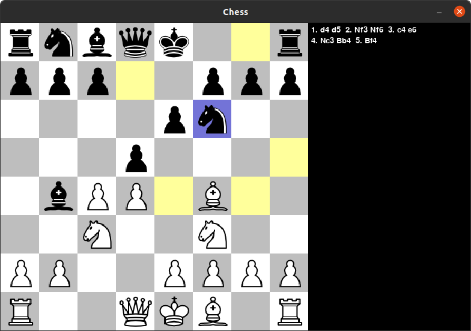

# Python Chess Engine

## General info
I have been playing chess for a long time since my childhood. This passion of playing chess sparked a curiosity in me to explore how the chess game works under the hood. So, I came across Eddie's YouTube channel searching for resources to understand the logic behind Chess. So, I ventured further and implemented this Chess game.

[Eddie's YouTube channel](https://www.youtube.com/channel/UCaEohRz5bPHywGBwmR18Qww)

[First episode of "Chess engine in Python"](https://www.youtube.com/playlist?list=PLBwF487qi8MGU81nDGaeNE1EnNEPYWKY_)

## Engine Improvements TODO
feel free to contribute :grinning:
- [ ] Calculate both players moves given a position.
- [ ] Stalemate on 3 repeated moves or 50 moves without capture/pawn advancement.
- [ ] If move is a capture move, even at max depth, continue evaluating until no captures remain (not sure if this could help calculating the board score better).
- [ ] Using numpy arrays instead of 2d lists.

## Instructions
1. Clone this repository 
2. Run `python3 -m pip install -r ./requirements.txt`
3. Run `python3 ChessMain.py`.
4. Enjoy the game!

#### Keys:
* Press `z` to undo a move.
* Press `r` to reset the game.

#### Notes: 
* For now, the game runs with PvP mode enabled.

## Further development done
1. Added book moves using csv file for reducing engine overhead at initial phase of game
